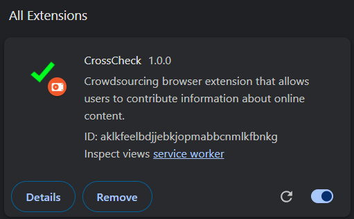

# Crosscheck

Design Project in CS473 Introduction to Social Computing @ KAIST

## Installation

1. Create a file named `/src/utils/Env.ts`, and insert the following environment variables.

```ts
export const FIREBASE_API_KEY = '<API_KEY>'
export const FIREBASE_AUTH_DOMAIN = '<FIREBASE_AUTH_DOMAIN>'
export const FIREBASE_DATABASE_URL = '<FIREBASE_DATABASE_URL>'
export const FIREBASE_PROJECT_ID = '<FIREBASE_PROJECT_ID>'
export const FIREBASE_STORAGE_BUCKET = '<FIREBASE_STORAGE_BUCKET>'
export const FIREBASE_SENDER_ID = '<FIREBASE_SENDER_ID>'
export const FIREBASE_APP_ID = '<FIREBASE_APP_ID>'
export const FIREBASE_MEASUREMENT_ID = '<FIREBASE_MEASUREMENT_ID>'
```

2. Run `npm install` in the project root to install dependencies.
   
4. Once the environment file exists run `npm run build` in the project root to make a production build of the project.
   This should create a new folder named `build` that can be installed in Google Chrome.

5. Open Google Chrome to the `chrome://extensions` page, enable _Developer mode_, and the load the `build` folder using the _Load unpacked_ buttons.
   This should make the extension appear as an unpacked extension in the extension list.

 
 
 

4.  For simple access to the extension interface pin the icon in the top right just like with any other Google Chrome Extension.

## Development

For development it is recommended to use `npm run dev` and view the extension popup like a normal website when developing the UI to be able to utilize the live reload features React offers. However, some Chrome API functions that the application relies on will not function correctly when the extension is not run as an extension in the browser.

If changes have been made to the extensions content scripts or manifest, it has to be reloaded using the reload button in the extension overview.
UI changes made to the unpacked extension will appear automatically as Chrome uses the HTML files directly.

##The Code

###/src/chrome
content_script.ts is run every time a user loads a new website.
service_worker.ts runs constantly in the browser and handles user input and pop-ups.
###/src/components
This folder contains the components of the React-application.
###/src/routes
The routes folder contains the top level "Routes", and thus describes the main pages, that we are using in our application. 
###/src/utils
The utils directory contains:
Types.ts for custom Typescript types
Constants.ts for hard-coded data for local development
Firebase.ts, which handles the communication with our firebase backend
